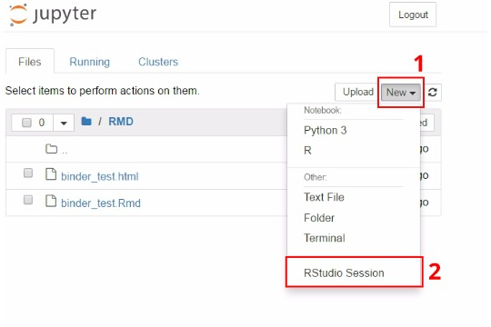

# hypurrr-ameters Blog post, Scripts, and Executable Rstudio Binder!

### Description
R scripts and executable binder for blog post about using Purrr for mapping over ML hyperparameters

### Link to blog post (when done...)
[MDH blog](http://matthewdharris.com)

### Executable RStudio Binder

Click the button above (into a new tab) to launch this repo into an Rstudio binder in your browser! After clicking the button, wait a moment for the [https://mybinder.org/](https://mybinder.org/) service to build this repo into a new binder. Once built, you will see a screen like that below. First click `New` on the lefthand side, then click `Rstudio Session` from the drop-down list. This will open a new cloud based Rstudio session right in your browser. From there, you can click in the `Files` to the `RMD` folder and then click on the `binder_test.Rmd` to open the blog post markdown. Run, edit, modify the code and have fun!

